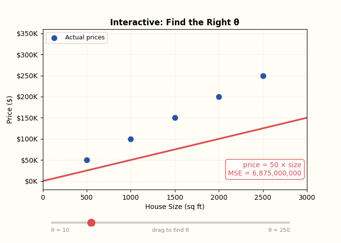
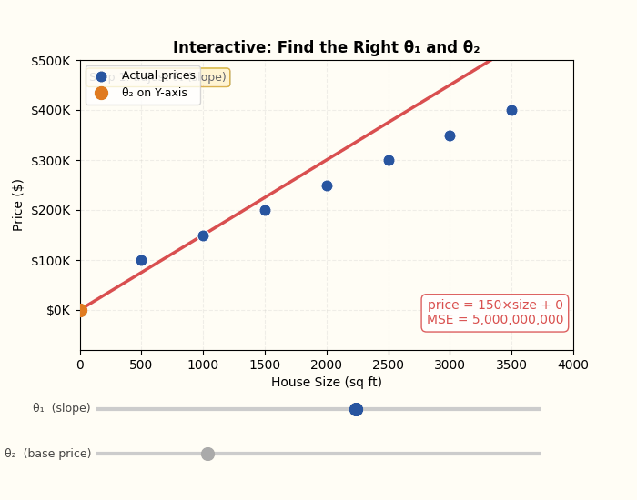

# Understanding LLM

Interactive code for the series: [Medium – Understanding LLM](https://medium.com/@mohansujay22054044/58b20eddf2f4)

## Table of contents

- [What's in here](#whats-in-here)
- [Setup](#setup)
- [Run](#run)
- [Series](#series)

---

## What's in here



**Part 1 — What is a Model?**

| File | Description |
|---|---|
| `theta1.py` | One parameter. Learns `price = θ × size` from scratch. |
| `theta2.py` | Two parameters. Learns `price = θ₁ × size + θ₂`. Discovers a hidden base cost. |
| `interactive_theta1.py` | Drag a slider to find the right θ yourself. |
| `interactive_theta2.py` | Two sliders — find both θ₁ and θ₂ by hand. |

---

## Setup

```bash
pip install numpy matplotlib
```

---

## Run

```bash
# follow along with the blog
python theta1.py
python theta2.py

# play with it yourself (opens a window)
python interactive_theta1.py
python interactive_theta2.py
```

---



## Series

| Part | Topic | Status |
|---|---|---|
| Part 1 | What is a Model? | ✅ [Read on Medium](https://medium.com/@mohansujay22054044/58b20eddf2f4) |
| Part 2 | How Does a Model Read Words? | Coming soon |
| Part 3 | What is Training Data? | Coming soon |
| Part 4 | What Makes GPT Different? | Coming soon |

---

<p align="center">
  <br>
  Made by Mohan/Sujay ⭐
</p>
